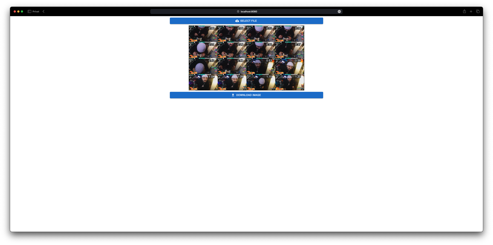

# A simple video grid thumbnail creator

Simply select an video and you will receive a grid thumbnail image .

All files are processed locally via Javascript, so no Files are sent anywhere.

[Example (https://grid-thumbnail-creator.e-hess.com)](https://grid-thumbnail-creator.e-hess.com)

## Quick Start

### Using docker

```bash
docker run -it --rm \
    --publish 8080:80 \
    ghcr.io/eric-hess/grid-thumbnail-creator:latest
```

Now you can access the webpage via the following link: `http://localhost:8080`

### Using npm

1. Install dependencies:

```bash
npm install
```

2. Run the dev server:

```bash
npm run start
```

Now you can access the webpage via the following link: `http://localhost:3000`

## Docker Compose Example
[docker-compose.yml](./docker/docker-compose.yml)
```yml
services:
    grid-thumbnail-creator:
        image: ghcr.io/eric-hess/grid-thumbnail-creator:latest
        restart: unless-stopped
        ports:
            - 8080:80
```

## Screenshots

